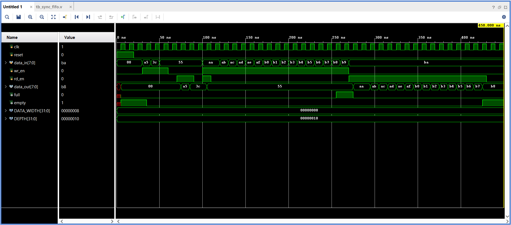

# Synchronous FIFO RTL Design (Verilog)

## Overview
This project implements a parameterized Synchronous FIFO (First-In First-Out) in Verilog HDL. The design supports configurable data width and FIFO depth with synchronous read and write operations.

## Features
- Parameterized Data Width and FIFO Depth
- Synchronous Read Operation
- Synchronous Write Operation
- Full Flag Generation
- Empty Flag Generation
- Circular Pointer Implementation
- Overflow Protection
- Underflow Protection
- Simultaneous Read and Write Support
- Testbench for Verification
- Simulation Waveform

## Project Files

- `sync_fifo.v` – RTL implementation
- `tb_sync_fifo.v` – Testbench
- `sync_fifo_waveform.png` – Simulation waveform

## Simulation Waveform

The waveform below demonstrates FIFO write, read, simultaneous read/write, full, and empty operations.

## Tools Used
- Verilog HDL
- Xilinx Vivado
- Git
- GitHub

## Author
Harshit Singh Chauhan
